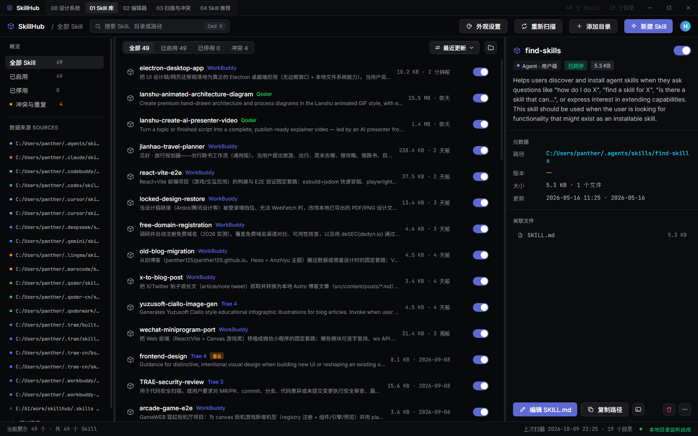
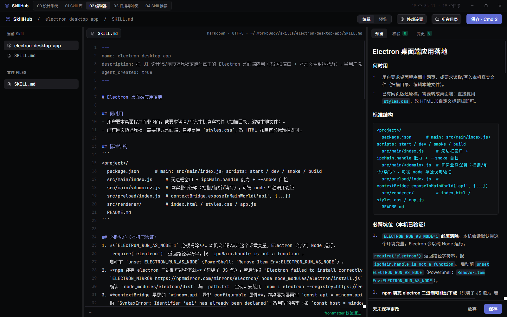
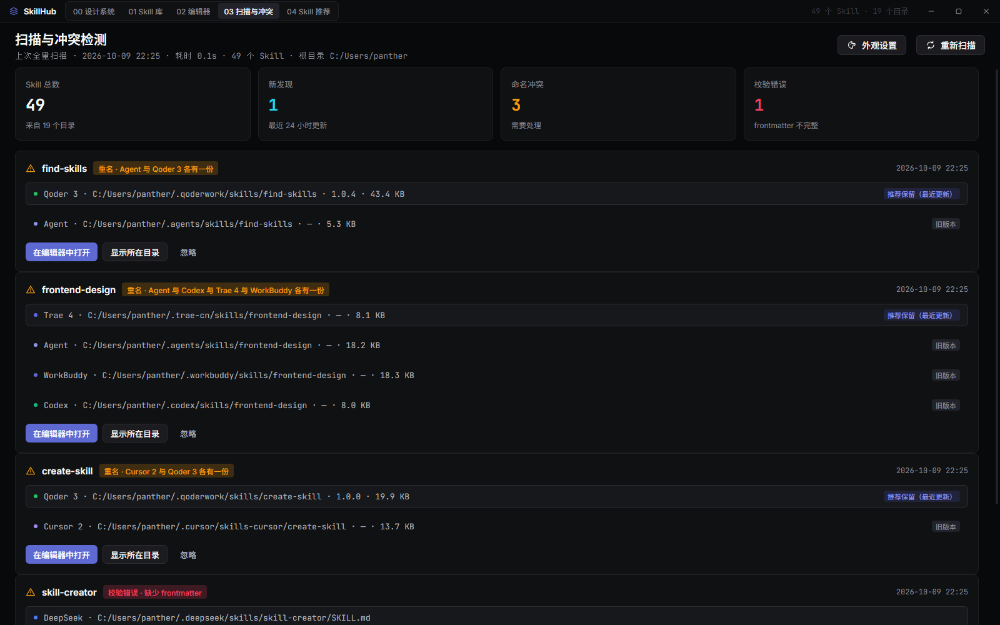
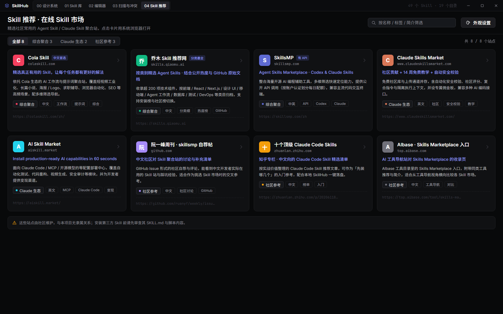
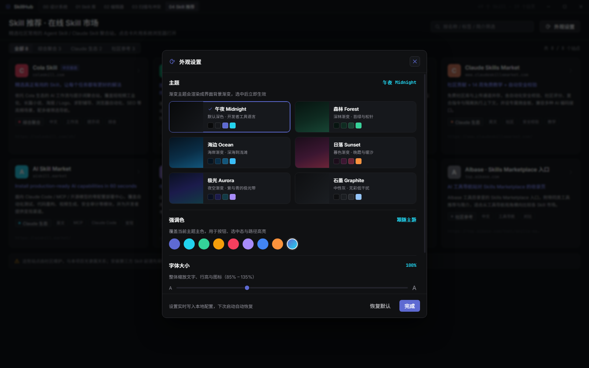
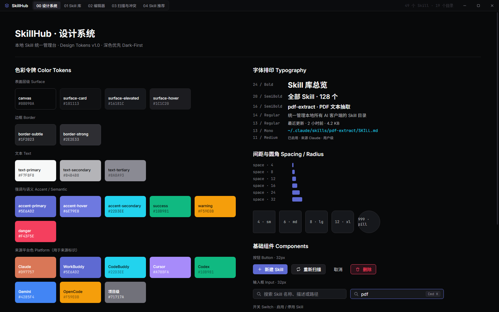

<div align="center">

# SkillHub

**本地 Skill 统一管理台**

把散落在本机各个 AI 客户端里的 Skill 收拢到一个桌面应用里 —— 扫描、浏览、启停、编辑、查冲突，一处搞定。

[](https://www.electronjs.org/)
[](#)
[](#)



<sub>本机实测画面：49 个 Skill / 19 个来源目录 / 3 组命名冲突，全部来自真实本地扫描</sub>

</div>

---

## 这是什么

你在 Claude、Cursor、CodeBuddy、WorkBuddy、Trae、Qoder、Codex…… 各个客户端里都攒了一堆 Skill。它们分散在 `~/.claude/skills`、`~/.cursor/skills`、`~/.trae/skills` 等等十几个目录里，谁跟谁重名、哪个上次改了、某个 SKILL.md 的 frontmatter 写漏了 —— 全靠手动翻文件夹。

SkillHub 把这些目录**自动找出来、扫进来、摆在同一张表里**，并且能干这些事：

- **动态发现**：不用你配置路径清单，它自己遍历用户主目录找出所有 AI 客户端的 skill 目录
- **真读写**：启停是真往目录里写标记文件，编辑是真写回磁盘，删除是真移进回收站
- **看得见的冲突**：同一个 Skill 在 4 个客户端各有一份？直接列出来让你决定保留哪份

## 截图

### 01 · Skill 库

即上方顶图。左栏按状态（全部 / 已启用 / 已停用 / 冲突）与数据来源筛选，中间列出扫描到的 Skill，右栏检查器显示元数据与关联文件。列表行 hover 出现回收站按钮，右侧开关直接启停。

### 02 · SKILL.md 编辑器

带行号的 Markdown 编辑器，frontmatter / 标题 / 正文分行着色。**双击列表任意一行即可进入**。左侧可打开该 Skill 下的其它文件，右侧实时预览渲染好的 Markdown，底部做 frontmatter 校验（缺 `name` / `description` 会立刻提示）。



### 03 · 扫描与冲突

顶部统计卡（总数 / 24 小时内更新 / 命名冲突 / 校验错误）。冲突卡会列出同名 Skill 分别躺在哪些平台、各自版本与体积，并标注「推荐保留（最近更新）」和「旧版本」，可一键在编辑器中打开处理。



### 04 · Skill 推荐

内置常用在线 Skill 市场入口（Cola Skill / 乔木 / SkillsMP / Claude Skills Market / AI Skill Market 等），按分类和关键词筛选，点击用系统浏览器打开。



### 外观设置

六套主题（午夜 / 森林 / 海边 / 日落 / 极光 / 石墨）、8 色强调色、85%–135% 字号缩放，全部实时生效并持久化。四套渐变主题会把背景渲染成渐变色。



### 00 · 设计系统

界面自身的 Design Tokens：色彩令牌、字体排版、间距圆角、基础组件。改主题时这一页会跟着变。



## 快速开始

```bash
git clone git@github.com:panther125/skillhub.git
cd skillhub
npm install
npm start
```

| 命令 | 作用 |
|---|---|
| `npm start` | 启动桌面端 |
| `npm run dev` | 启动并自动打开 DevTools |
| `npm run smoke` | 无窗口自检：加载完成后打印 `SMOKE_READY` 并退出 |
| `npm run build` | 打包 Windows x64 安装包到 `dist/`（需先装 `electron-builder`） |

> **Windows 用户注意**：若环境变量里存在 `ELECTRON_RUN_AS_NODE=1`，Electron 会以纯 Node 模式启动而不显示窗口。
> 启动前先清掉：Git Bash 用 `unset ELECTRON_RUN_AS_NODE`，PowerShell 用 `Remove-Item Env:ELECTRON_RUN_AS_NODE`。

## 功能

**扫描与发现**

- 遍历用户主目录一级子目录，命中 AI 客户端名称关键词（claude / cursor / codex / gemini / workbuddy / codebuddy / opencode / trae / qoder / windsurf / copilot / kiro / lingma / cline / aider / continue / zed / augment / replit / kilo / roo / agent …）后进入其 skill 目录
- skill 目录名识别支持 `skills` / `.skills` / `builtin_skills` 等；一级没找到会再往下看一层（如 `~/.xxx/plugins/skills`）
- 项目级 `./.skills` 与手动添加的目录始终参与扫描
- 内置排除 `sync / cache / template / backup / tmp / log / test` 等噪音目录

**管理**

- 按状态（全部 / 已启用 / 已停用 / 冲突）与来源筛选，搜索名称、描述、路径
- 启停开关在该 Skill 目录内写入 / 删除 `.skillhub-disabled` 标记，**非破坏性**
- 删除 Skill：列表行 hover 的回收站图标或检查器右下角按钮 → 确认框显示名称 / 来源 / 规模 / 完整路径 → 确认后**移入系统回收站**（可还原）。仅允许删除「直接位于已管理源目录下」的目录，源目录本身、系统目录、`..` 逃逸路径一律拒绝
- 新建 Skill：在来源目录生成 `<name>/SKILL.md` 模板并直接打开编辑（名称做小写 / 连字符校验，重名拦截）

**编辑**

- 按行硬换行编辑（超长行横向滚动，不软折行），frontmatter / 标题 / 正文分行着色
- Enter 换行、Backspace 在行首删除整行并把光标送回上一行行尾
- 侧栏可打开 Skill 下的其它文件（如 `scripts/*.py`）
- 右侧实时 Markdown 预览（段落合并、列表成组、代码块、行内语法）+ frontmatter 校验
- `Cmd/Ctrl + S` 写回磁盘

**界面**

- **可拖拽分栏**：左栏 180–520px、右栏 300–820px，**双击分隔线复位**，宽度持久化
- **外观设置**：主题 / 强调色 / 字号，实时生效并写入配置

**快捷键**

| 按键 | 作用 |
|---|---|
| `Cmd/Ctrl + K` | 聚焦搜索 |
| `Cmd/Ctrl + S` | 保存当前文件 |
| `Esc` | 清空搜索 / 关闭弹窗 |

## 外观设置

每页头部工具栏的「外观设置」按钮打开，三组设置：

| 分组 | 内容 |
|---|---|
| 主题 | 午夜 Midnight（默认）/ 森林 Forest / 海边 Ocean / 日落 Sunset / 极光 Aurora / 石墨 Graphite |
| 强调色 | 8 色可选，或「跟随主题」；主色、hover、亮版、淡底由 hex 混白算法推导 |
| 字体大小 | 85% – 135% 滑块，整体缩放文字 / 行高 / 列表行高 / 图标 |

渐变主题把 `--canvas`、`--shell-bg` 设为 160° 渐变，面板改用半透明 surfaces 让背景透出来；石墨是唯一的无彩中性主题。

**新增主题**：往 `src/renderer/app.js` 的 `THEMES` 里加一项，需提供 20 个令牌 ——
`canvas` / `shell-bg` / 4 档 `surface` / `sunken` / 2 档 `border` / 4 档 `text` / 5 个 `accent` / `code-bg` / `code-text`。

## 配置

配置写在 `userData/skillhub-config.json`（Windows 下即 `%APPDATA%\skillhub\skillhub-config.json`）：

```jsonc
{
  "layout":      { "sidebar": 260, "aside": 420 },   // 分栏宽度
  "theme":       { "id": "midnight", "accent": null, "fontScale": 100 },
  "customSources": ["D:\\my-skills"],                // 手动添加的目录
  "aiKeywords":  ["myagent", "foo"]                  // 临时追加的扫描关键词
}
```

- 想扩充扫描关键词：改 `src/main/scanner.js` 的 `AI_PLATFORMS`（名称 + 平台色），或只在配置文件里加 `aiKeywords`
- 想改 skill 目录识别规则：见 `scanner.js` 的 `isSkillDirName()`

## 目录结构

```
src/
  main/
    index.js     主进程：无边框窗口、IPC（含 shell:openExternal 协议白名单）、生命周期
    scanner.js   目录扫描、frontmatter 解析、启停标记、冲突检测、配置读写
  preload/
    index.js     contextBridge 安全桥接（window.api）
  renderer/
    index.html   五屏结构（00 设计系统 / 01 库 / 02 编辑器 / 03 扫描与冲突 / 04 推荐）+ 自定义标题栏
    styles.css   设计令牌 + 组件样式
    app.js       渲染与交互逻辑（含 REC_SITES 在线市场数据、THEMES 主题定义）
docs/
  screenshots/   README 截图
```

## 技术要点

几个踩过坑、值得记的地方：

**无边框窗口的拖拽区** — 自定义标题栏用 `-webkit-app-region: drag`，但子树里的按钮必须显式声明 `no-drag`，否则点击会被窗口拖拽吞掉（症状是「按钮看得见但点了没反应」，且控制台无任何报错）。

**列表「单击选中 + 双击进入」** — 单击处理里如果整块重建列表的 `innerHTML`，第一下点击就把当前节点从 DOM 摘掉了，浏览器会判定第二下落在「新元素」上，**`dblclick` 永远不派发**。所以单击只做局部选中态更新（`classList.toggle`），不重建。

**编辑器硬换行** — `.cl-code` 设 `white-space: pre`，但后面的 `.cl-code[contenteditable]` 选择器更具体会把它覆盖成 `pre-wrap`。改样式前先搜一遍同名属性的所有声明。

**字号缩放** — 所有字号 / 行高 / 图标尺寸都写成 `calc(Npx * var(--fs-scale))`，由字号滑块统一驱动。**不要再改成固定 px**，否则该处不跟随缩放。

**扫描方式** — v1.3 起改为动态发现，不再依赖硬编码路径清单。

## 打包

`electron-builder` 已列入 `devDependencies`，克隆后 `npm install` 会自动装好：

```bash
npm run build          # 产出 Windows x64 安装包到 dist/
npm run build:dir      # 只解包不压缩，用于快速验证打包结果（快很多）
```

产物：

- `dist/SkillHub-1.0.0-x64.exe` —— NSIS 安装包（可选安装目录、创建桌面与开始菜单快捷方式、支持卸载）
- `dist/SkillHub-1.0.0-portable.exe` —— 免安装绿色版，双击即用

打包配置写在 `package.json` 的 `build` 段（appId / 产品名 / 目标格式 / NSIS 选项）。
应用图标为 `build/icon.png`（512×512，electron-builder 会自动生成各尺寸 `.ico`）。

> 国内网络下首次打包需下载 electron 二进制与 NSIS 工具，可能较慢。
> 可先设镜像：`export ELECTRON_MIRROR=https://npmmirror.com/mirrors/electron/`。

## 在线市场数据维护

`04 Skill 推荐` 的站点清单硬编码在 `src/renderer/app.js` 的 `REC_SITES` 数组里：

| 字段 | 说明 |
|---|---|
| `id` | 唯一标识 |
| `name` | 站点名 |
| `url` | 跳转链接（必须 https / http） |
| `tagline` | 一句话卖点（卡片高亮行） |
| `desc` | 详细介绍（3 行截断） |
| `tags` | 标签数组（渲染成 chip） |
| `cat` | 分类，需在 `REC_CATS` 里登记 |
| `color` | 首字母色块背景色 |
| `badge` | 可选，右上角强调徽章 |

追加站点直接往数组里加即可，无需改 HTML / CSS；新增分类要同步改 `REC_CATS`。

## License

MIT © panther125
